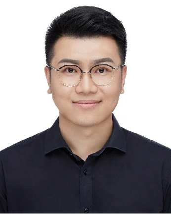
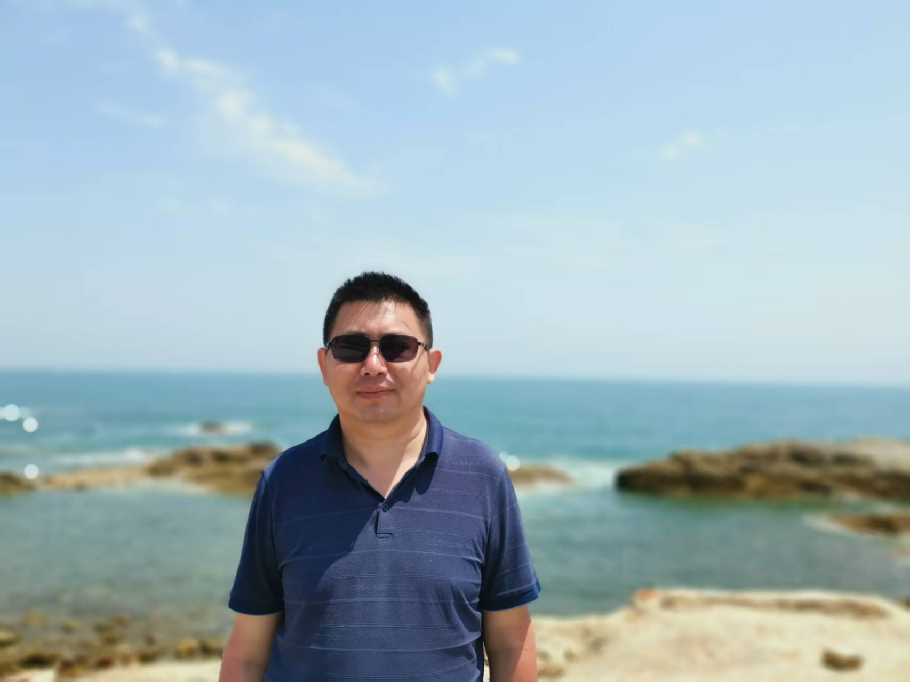
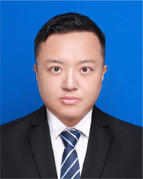

<!-- 核心样式：定义带文字的图片容器 -->

<!-- 页面内容 -->

AI4S创新团队 
(AI for Science)

::: {#center}

## 实验室简介

**AI4S创新团队**隶属于山东大学控制科学与工程学院**视觉感知与智能系统教育部重点实验室**，致力于计算机视觉、模式识别、机器学习和人工智能等前沿领域的研究，以高新技术为核心手段，解决关键科学问题、加速科研进程与技术创新，助力科学发展。本团队由教授、副教授、青年教师和博士/硕士研究生组成的高水平研究团队，在国内外重要学术期刊和会议上发表论文近百篇，主持和参与多项国家级和省部级科研项目。

## 团队简介
团队负责人**张敬林教授**，教授，博导，泰山学者-特聘教授，山东省杰出青年、齐鲁青年学者和全球前2%顶尖科学家，聚焦于人工智能在**气象遥感和赋能工业场景**中的前沿研究，涵盖：气象卫星云图识别与热带气旋预测、视觉语言大模型、工业异常检测、浮游生物识别和具身智能。已发表Nature Communications、AAAI、TNNLS、TII、TGRS等CCFA类和IEEE汇刊论文70余篇。获中国计算机学会技术发明二等奖、中国图像图形学会科技进步二等奖和广东省技术发明一等奖等奖励。主持科技部重点研发项目和国家自然科学基金联合基金等10余项，与复旦大学、天津大学、航天宏图和山东省计算中心等企业和科研机构合作，通过产学研用合作，联合研制具有国际竞争力的气象遥感与智能解释关键技术与平台。团队坚持“拒绝平庸 突破自我”理念--既追求国际一流学术突破，致力推动技术落地于气象服务和工业应用等领域。

## 近期研究成果

<!-- 核心样式：动态效果+卡片布局 -->

<!-- 成果1：2025年最新成果（加NEW标识） -->

<!-- 动态NEW标识（右下角） -->

NEW

2026

<h3 class="pub-title">AI weather prediction toward multi-scale Earth system prediction: status and pathways</h3>

Science Bulletin
 <!-- 会议名粗体 -->

作者: Zhang J, Chen Q, Zhang F, Niu Z, Zhang Z, Ling F, Guo B, Liu H, Bai C, Li G, Zhang R

<!-- 成果1：2025年最新成果（加NEW标识） -->

<!-- 动态NEW标识（右下角） -->

NEW

2026

<h3 class="pub-title">Unification of Closed-Open Industrial Detection Scenarios: New Large-Scale Benchmarks, Challenges and Baselines</h3>

IEEE Transactions on Pattern Analysis and Machine Intelligence
 <!-- 会议名粗体 -->

作者: Zhang, Zekai and Zhang, Jinglin and Chen, Qinghui and Li, Gang and Chen, Da

<!-- 新增GitHub链接 -->

GitHub: <a href="https://github.com/hellozzk/MMIO.git" target="_blank">https://github.com/hellozzk/MMIO.git</a>

<!-- 成果1：2025年最新成果（加NEW标识） -->

<!-- 动态NEW标识（右下角） -->

NEW

2026

<h3 class="pub-title">A Novel Dataset and Lightweight Distillation Baseline for Highlight Transparent Object Detection</h3>

International Journal of Computer Vision
 <!-- 会议名粗体 -->

作者: Zhang, Zekai and Zhou, Mingle and Wan, Honglin and Li, Min and Li, Gang and Han, Delong

<!-- 成果1：2025年最新成果（加NEW标识） -->

<!-- 动态NEW标识（右下角） -->

2025

<h3 class="pub-title">Fine-tuning feature interaction for unsupervised domain adaptive low-light object detection</h3>

Neurocomputing
 <!-- 会议名粗体 -->

作者: Maomao Xiong, Qunshu Zhang, Dagang Li, Wenmin Wang, Zaigui Zhang, Kai Zhang, Cong Liu, Da Chen, Jinglin Zhang

<!-- 新增GitHub链接 -->

GitHub: <a href="https://github.com/Jinglin-Zhang/FFINet" target="_blank">https://github.com/Jinglin-Zhang/FFINet</a>

<!-- 成果2：2025年最新成果（加NEW标识） -->

<!-- 动态NEW标识（右下角） -->

2025

<h3 class="pub-title">Distilled large language model-driven dynamic sparse expert activation mechanism</h3>

Applied Soft Computing
 <!-- 会议名粗体 -->

作者: Qinghui Chen, Zekai Zhang, Zaigui Zhang, Kai Zhang, Dagang Li, Wenmin Wang, Jinglin Zhang, Cong Liu

<!-- 新增GitHub链接 -->

GitHub: <a href="https://github.com/Jinglin-Zhang/DS-MoE" target="_blank">https://github.com/Jinglin-Zhang/DS-MoE</a>

<!-- 成果3：2025年成果（无NEW） -->

2025

<h3 class="pub-title">Benchmark Dataset and Deep Learning Method for Global Tropical Cyclone Forecasting,Nature Communications</h3>

Nature Communications
 <!-- 期刊名粗体 -->

作者: Cheng Huang, Pan Mu, Jinglin Zhang, Sixian Chan, Shiqi Zhang, Hanting Yan, Shengyong Chen & Cong Bai.

<!-- 只保留必要样式，避免干扰解析 -->

## 团队老师

<h3 class="member-name">张敬林 教授 山东大学</h3>

<strong>AI4S创新团队 团队负责人 博导/硕导</strong>

主要研究人工智能、海洋遥感以及工业大数据分析，在CVPR、AAAI等会议和Trans期刊发表70余篇，主持国家自然科学基金、科技部重点研发项目等国家级课题5项。获中国计算机学会技术发明二等奖、中国图像图形学会科技进步二等奖和广东省技术发明一等奖等奖励。

人工智能
海洋遥感
工业大数据

<h3 class="member-name">鲁威志 副教授 山东大学</h3>

<strong>AI4S创新团队 硕导</strong>

研究领域涵盖信号处理与机器学习，近期尤其关注深度神经网络的结构可解释性与轻量化设计，通过融合压缩感知的稀疏约束机制、随机投影的降维优化思想，以及统计学习的理论验证方法，构建理论透明且计算高效的模型体系。

压缩感知
机器学习
信号与图像处理

<h3 class="member-name">李垣江 教授 江苏科技大学</h3>

<strong>AI4S创新团队 硕导</strong>

中澳（镇江）人工智能研究院副院长，江苏省冷链学会副秘书长，江苏省电子学会理事，入选镇江市“金山英才”计划

故障诊断
电池预测
模式识别

## 研究方向

  AI4S
  基于工业场景的视觉语言模型
  气象预报
  浮游生物的识别与监测
  气象遥感
  异常监测
  具身智能
  故障诊断

## 加入我们

欢迎具有以下背景的同学加入本团队攻读硕士/博士学位或从事博士后研究：

- 计算机、自动化、电子、数学、气象等相关专业
- 熟悉 Python / PyTorch / TensorFlow / OpenCV
- 对 AI 在工业、气象等领域的应用有浓厚兴趣

🎓 招收：硕士生、博士生、博士后、科研实习生  
📧 请将简历发送至：<strong>Jinglin.zhang@sdu.edu.cn</strong>

<footer>
  &copy; 2026 山东大学 张敬林教授团队 | 
  地址：山东大学千佛山校区北院创新大厦二期515 -- 视觉感知与智能系统教育部重点实验室| 
  邮箱: <a href="mailto:Jinglin.zhang@sdu.edu.cn">Jinglin.zhang@sdu.edu.cn</a>
</footer>

:::

